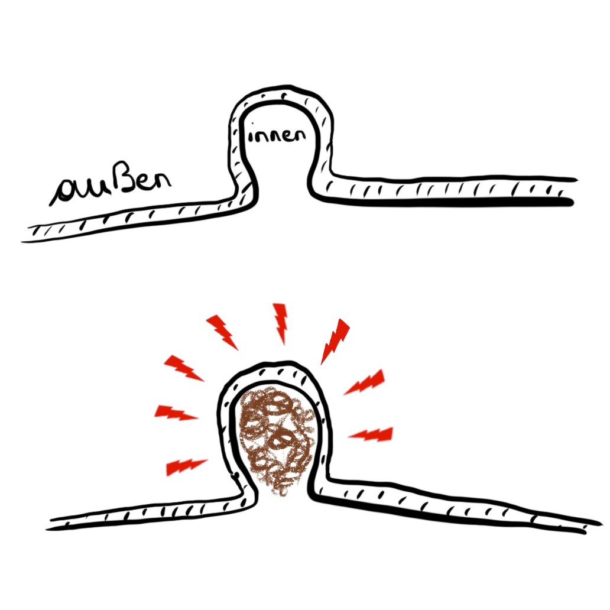

---
categories:
  - value: Diätologischer Jahresstart 2021
    label: Diätologischer Jahresstart 2021
title: Divertikel
date: 2021-01-08T05:00:00.000Z
coverImage: ../assets/mittelbach_l-rezept.jpg
coverImageAuthor: Lisa Mittelbach
coverImageLink: https://www.facebook.com/lisa.mittelbach
---
Hast du bereits von Divertikeln gehört und möchtest nun Genaueres über diese wissen? Ist dir der Begriff noch unbekannt, du interessierst dich jedoch für medizinische und ernährungstherapeutische Themen? Dann bist du hier genau richtig. In den nächsten Absätzen werde ich dir einen Überblick über Divertikel geben und erklären, in welchem Zusammenhang die Ernährung damit steht. Am Ende des Artikels erwartet dich sogar ein köstliches und zu dem Thema passendes Rezept, das du sofort ausprobieren kannst!

## Was sind Divertikel?

Divertikulose ist die Bezeichnung für bestimmte Veränderungen im Darm. Es bilden sich kleine, sackförmige Ausstülpungen in der Darmwand, die sogenannten Divertikel. 

Meist kommen diese in einem bestimmten Teil des hinteren Dickdarms, dem Sigma, vor. Divertikel können aber auch seltener im restlichen Dickdarm oder anderen Abschnitten des Verdauungstraktes auftreten. Auch wenn man nicht so häufig über Divertikel hört, ist die Divertikulose sehr häufig und zählt sogar zu den Zivilisationskrankheiten.

## Wo und wie entstehen Divertikel?

Die Ausstülpungen bilden sich aller Voraussicht nach aufgrund einer ballaststoffarmen Ernährung und wenig körperlicher Bewegung, wie es bei uns in den westlichen Ländern häufig vorkommt. Zu wenige Ballaststoffe sorgen für einen harten und festen Stuhl, was sich meist zuerst als Verstopfung äußert. Dadurch ist der Innendruck in unserem Darm erhöht und an Schwachstellen der Darmschleimhaut stülpen sich die Divertikel aus. Zusätzlich treten sie im höheren Alter häufiger auf, weil das Bindegewebe des Darms mit dem Alter schwächer wird. An sich sind Divertikel nicht gefährlich und verursachen auch keine Schmerzen oder andere Symptome – ein Grund zum Aufatmen! Sie werden oftmals nur durch Zufall bei einer Darmspiegelung entdeckt und Ärztinnen und Ärzte stellen die Diagnose Divertikulose.

## Vorsicht Entzündung – die Divertikulitis

Wenn sich die Divertikel jedoch entzünden, spricht man von einer Divertikulitis (die Endung „itis“ steht immer für eine Entzündung). Die entzündeten Divertikel verursachen dann Schmerzen, welche meist im linken Unterbauch zu spüren sind. Zusätzlich kann auch Fieber, Übelkeit, Durchfall oder Verstopfung auftreten. Divertikel können sich beispielsweise dadurch entzünden, indem sich in ihnen Stuhlreste ansammeln und diese verstopfen. Durch eine Vermehrung von Bakterien kann es schließlich zur Divertikulitis kommen. Abhängig von der Schwere der Erkrankung und den Beschwerden wird die Entzündung behandelt. In leichten Fällen können Medikamente ausreichen, bei schwereren Verläufen oder bei immer wiederkehrenden Entzündungen können auch Krankenhausaufenthalte oder eine Operation notwendig sein.

## Welche Ernährungsempfehlungen gibt es?

Du fragst dich nun bestimmt, wie dein Essen bei vorhandenen Divertikeln aussehen sollte. Die Ernährungsempfehlungen unterscheiden sich deutlich zwischen einer Divertikulose und einer Divertikulitis.

Bei **beschwerdefreien Divertikeln (=Divertikulose**) und auch zur Vorbeugung solltest du ballaststoffreich essen und gleichzeitig ausreichend Flüssigkeit trinken. Ballaststoffe quellen im Verdauungstrakt auf und stimulieren die Darmbewegungen – dies wird auch Peristaltik genannt. Durch die Darmbewegungen werden vorhandene Divertikel durchgespült und gereinigt, und das Risiko für Entzündungen wird dadurch gesenkt. Auch körperliche Bewegung hat diesen Effekt, das heißt Sport und Bewegung regen ebenfalls Ihre Darmbewegung an und reinigen die Divertikel. Insgesamt ist es besonders wichtig, dass du auf einen regelmäßigen Stuhlgang achtest und bei Verstopfung Maßnahmen setzt – wie ausreichend zu trinken, sich zu bewegen oder Dörrpflaumen zu essen. Ziel ist es, den Druck in deinem Darminneren möglichst niedrig zu halten.

**Die Ernährungsweise bei einer Divertikulitis ist hingegen völlig anders.**
Hier ist es wichtig, die Entzündung gut ausheilen zu lassen und deinen Darm möglichst ruhig zu stellen. Das bedeutet, dass du deinen Darm nicht mit einer großem Ballaststoffmenge, schwer verdaulichen oder blähenden Lebensmitteln überfordern solltest und sich die Darmbewegung reduziert. Bei einem Krankenhausaufenthalt gibt es üblicherweise einige Tage Nahrungskarenz, an denen nichts gegessen werden soll. Anschließend solltest du die Menge nach und nach steigern – keine Sorge: du wirst sowohl von Ärztinnen und Ärzten als auch von Diätologinnen und Diätologen begleitet. Bei einer Divertikulitis solltest du ballaststoffarm und leicht Verdauliches essen und ausreichend Flüssigkeit trinken. Unter Fachkräften ist diese leicht verdauliche Ernährungsweise als „Leichte Vollkost“ (kurz LVK) bekannt und hat den Zweck, den gesamten Verdauungstrakt zu entlasten. Bei der Leichten Vollkost gibt es keine starren Regeln. Es sollte vor allem schwer Verdauliches wie sehr kalte oder heiße Speisen, scharf und stark Gewürztes, Frittiertes und stark Blähendes wie Zwiebel, Knoblauch, Kohl, Hülsenfrüchte oder Mineralwasser gemieden werden. Von Vorteil sind mehrere kleine Mahlzeiten und langsames Essen. Ein Beispiel für eine leicht verdauliche Speise wären gekochte Kartoffeln mit gedünsteter Zucchini und Aubergine und einem Joghurt-Dip. In Absprache mit deiner Diätologin oder deinem Diätologen wird die Leichte Vollkost ganz individuell auf dich abgestimmt und soll abhängig vom Verlauf der Entzündung ca. 4-6 Wochen eingehalten werden. Danach solltest du wieder langsam und schrittweise auf eine ballaststoffreichere Ernährung umstellen und regelmäßig Bewegung einbauen. Nach kompletter Ausheilung der Divertikulitis kannst du dann wieder ballaststoffreich, jedoch nicht blähend essen und trinken.

## Was bedeutet „ballaststoffreich“ genau?

Ballaststoffe sind Pflanzenfasern und Füllstoffe. Besonders ballaststoffreich sind Vollkornprodukte wie Naturreis, Vollkornbrot oder Vollkornnudeln. Auch Gemüse, Obst und Hülsenfrüchte wie Erbsen, Bohnen und Linsen enthalten viele Ballaststoffe – hier gilt die Empfehlung „5 am Tag“, also 3x täglich eine Handvoll Gemüse und 2x täglich eine Handvoll Obst. Als Ergänzung kannst du auch konzentrierte Ballaststoffquellen wie Haferkleie oder geschrotete Leinsamen verwenden. Diese machen sich beispielsweise ausgezeichnet in Müsli und Suppen. Wenn du viele Ballaststoffe isst ist es umso wichtiger genug zu trinken, damit die Ballaststoffe quellen können. Trinkst du zu wenig, können die Ballaststoffe nicht ausreichend aufquellen und es kann zur Verstopfung kommen - die ist wie wir wissen bei Divertikulose zu vermeiden. Es werden 1,5 – 2 Liter Flüssigkeit pro Tag empfohlen und besonders günstig sind Leitungswasser, Mineralwasser und ungesüßter Tee.

## Nüsse und Körner sind verboten, oder?

Kurze Antwort: Nein. Noch häufig kursiert das Gerücht, dass Nüsse, Körner, Mais und Popcorn bei Divertikulose gemieden werden müssen. Man stellte sich vor, dass sich diese in den Divertikeln verfangen, dort stecken bleiben und dadurch eine Entzündung hervorrufen. Nach neuerem Wissensstand weiß man nun, dass dies nicht der Fall ist und Nüsse und Co. ohne Bedenken gegessen werden können. Im Gegenteil zeigten Studien sogar, dass ein häufiger Konsum von Nüssen und Popcorn das Risiko für Komplikationen reduziert. Daher brauchst du dir keine Sorgen machen und kannst ohne Weiteres bei Nüssen und Co. zugreifen!

Dieses Overnight Bircher Müsli ist perfekt für deinen Start in den Morgen. Das Frühstück ist ja bekanntlich die wichtigste Mahlzeit des Tages. Du kannst den Großteil der Arbeit am Vortag erledigen, und das Müsli am nächsten Morgen entweder sofort genießen oder praktisch mit in die Arbeit nehmen. Dieses vollwertige und leckere Frühstück sättigt dich lange und liefert dir rund 11g Ballaststoffe – das ist schon ein Drittel deines täglichen Bedarfs! Bitte nicht vergessen: Trink ausreichend Wasser oder Tee dazu, damit die enthaltenen Ballaststoffe richtig quellen können und du von all Ihren positiven Wirkungen profitierst!

## Overnight Bircher-Müsli

### Zutaten für 1 Portion

* 40 g Haferflocken (feinblättrig oder grob)
* 10 g Haferkleie
* 10 g geschrotete Leinsamen
* 15 g Rosinen
* etwas Zimt nach Geschmack
* 150 ml Kuhmilch oder Pflanzendrink (z.B. Soja, Hafer)
* 100 g Naturoder Sojajoghurt
* 1 kleiner Apfel (geschnitten oder gerieben)
* Optional: 10 g gehackte Nüsse (z.B. Walnüsse, Haselnüsse, Paranüsse)

### Zubereitung

1. Die Haferflocken mit der Haferkleie, den Leinsamen, Rosinen und Zimt in ein Glas füllen und mit der Kuhmilch oder dem Pflanzendrink auffüllen. 
2. Alles gut umrühren und abgedeckt bzw. verschlossen über Nacht in den Kühlschrank stellen.
3. Am nächsten Morgen den Naturoder Sojajoghurt und einen kleinen geschnittenen oder geriebenen Apfel unterrühren. 
4. Optional mit gehackten Nüssen garnieren und genießen!